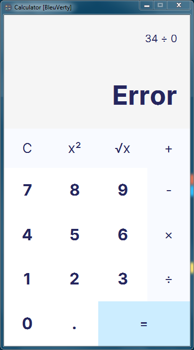

# Calculator
## Description
Create your own **Python Calculator** App using *Python* and *tkinter library*.

> Tkinter is already in your python's workstation without any *pip* installation

## Screenshot


---

## Create Standalone Executable
Of course, with python you can convert main file (.py) to executable file (.exe), just a few script in powershell or cmd if you work on windows environment:
1. cd to directory that contains your .py file
2. pyinstaller ...

```shell
pip install pyinstaller
pyinstaller -F -w -i icon.ico calculator.py
```
3. exe is located in the dist folder
